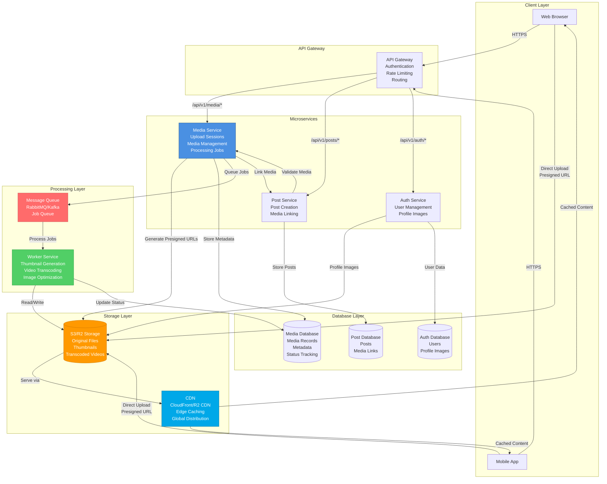
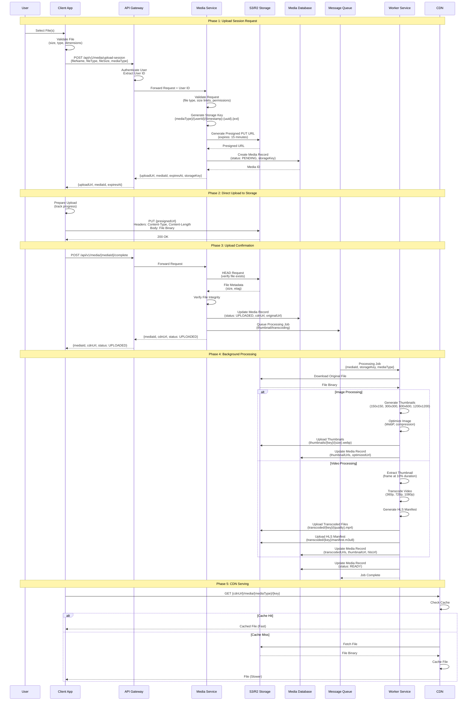
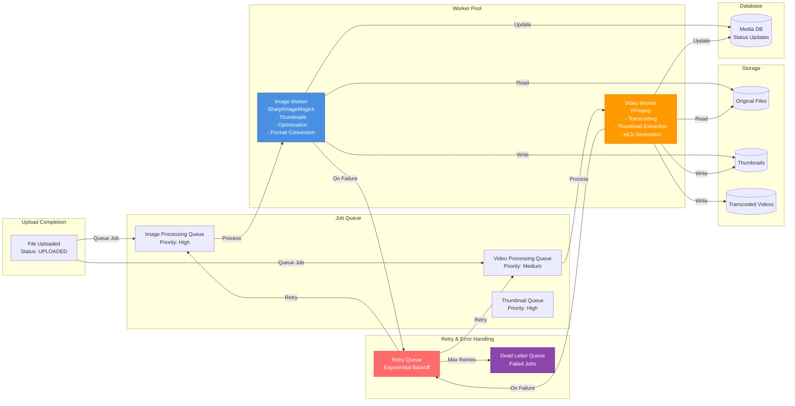
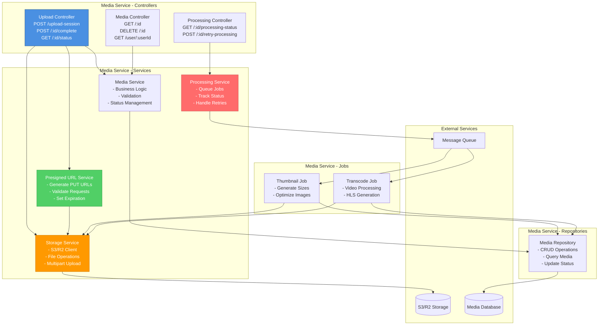
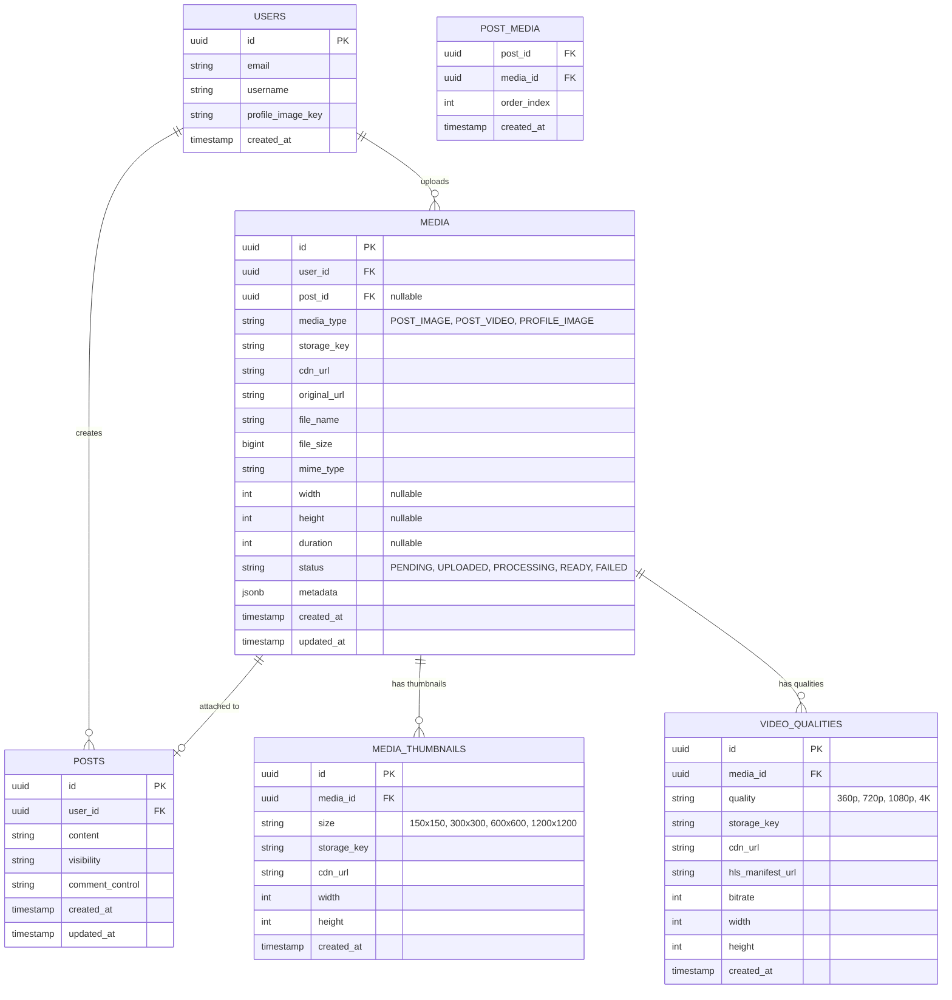
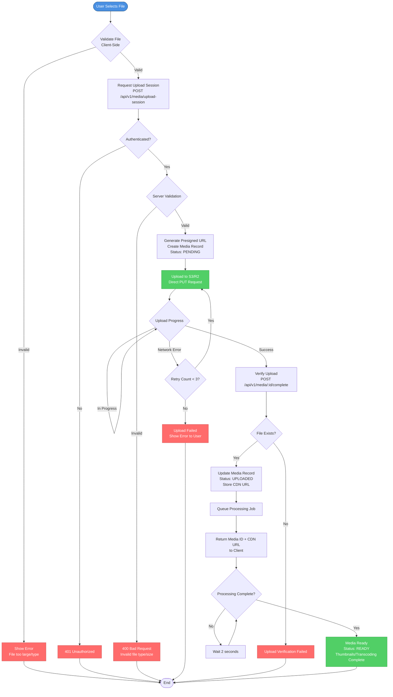
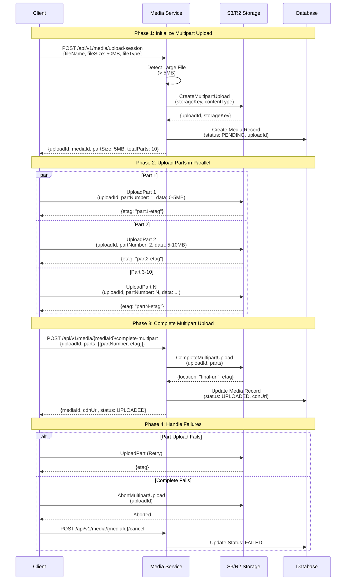
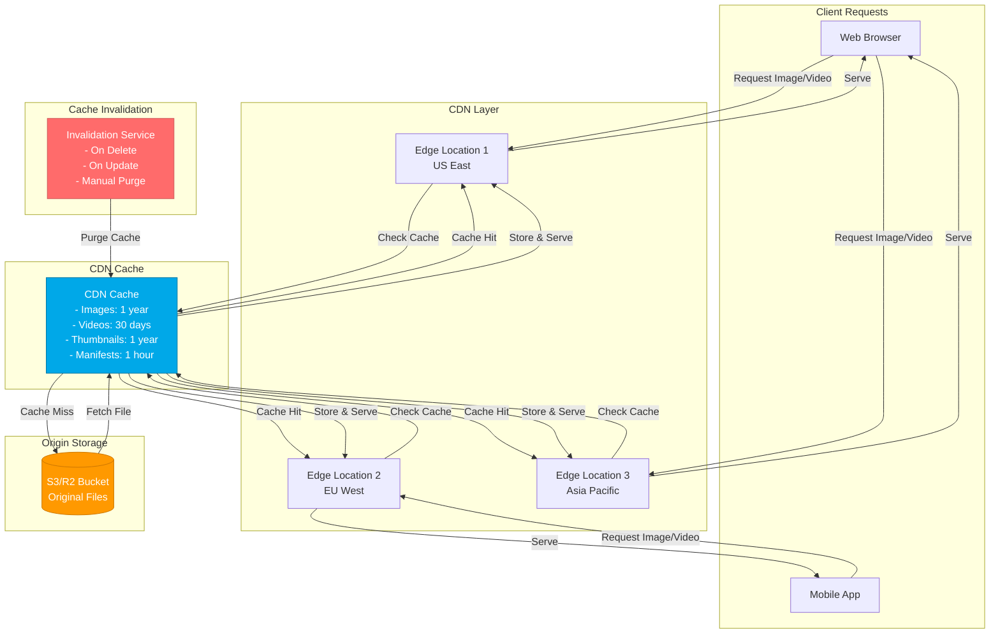
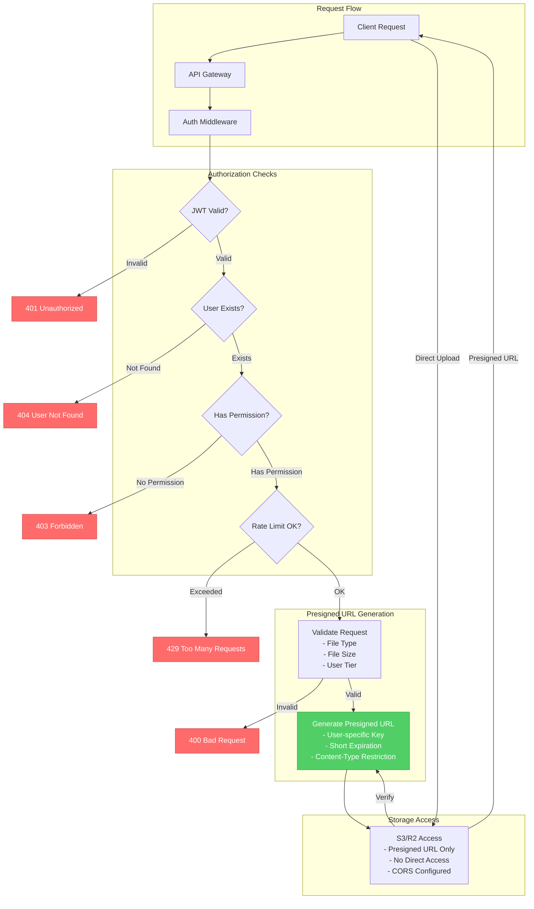
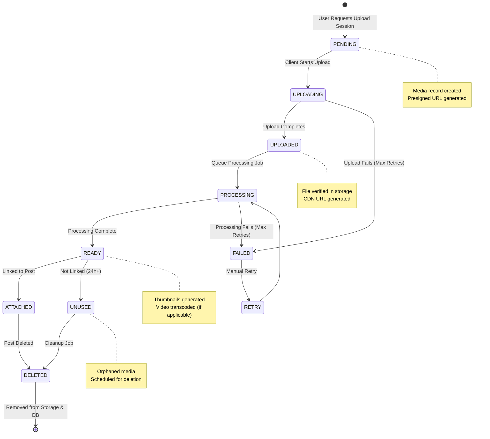

# Media Upload Architecture - Mermaid Diagrams

This file contains all Mermaid diagrams for the new media upload architecture. You can view these diagrams in:
- GitHub (renders Mermaid automatically)
- VS Code with Mermaid extension
- Online: https://mermaid.live
- Documentation tools that support Mermaid

---

## 1. High-Level System Architecture

---

## 2. Detailed Upload Flow Sequence Diagram

---

## 3. Processing Pipeline Architecture

---

## 4. Component Architecture - Media Service

---

## 5. Database Schema Relationships

---

## 6. Complete Upload Flow with Error Handling

---

## 7. Multipart Upload Flow (Large Files > 5MB)

---

## 8. CDN and Caching Strategy

---

## 9. Security and Access Control Flow

---

## 10. Media Lifecycle Management

---

## How to Use These Diagrams

1. **View in GitHub**: These diagrams will render automatically when you push to GitHub
2. **View in VS Code**: Install the "Markdown Preview Mermaid Support" extension
3. **View Online**: Copy any diagram code to https://mermaid.live
4. **Export as Image**: Use mermaid-cli or online tools to export as PNG/SVG
5. **Include in Documentation**: These work in most Markdown renderers that support Mermaid

## Diagram Index

1. **High-Level System Architecture** - Overall system components and connections
2. **Detailed Upload Flow Sequence** - Step-by-step upload process with all services
3. **Processing Pipeline Architecture** - Background job processing flow
4. **Component Architecture** - Media Service internal structure
5. **Database Schema Relationships** - ER diagram of media-related tables
6. **Complete Upload Flow with Error Handling** - Flowchart with all error paths
7. **Multipart Upload Flow** - Large file upload sequence
8. **CDN and Caching Strategy** - CDN architecture and cache flow
9. **Security and Access Control Flow** - Authentication and authorization flow
10. **Media Lifecycle Management** - State diagram of media status transitions

