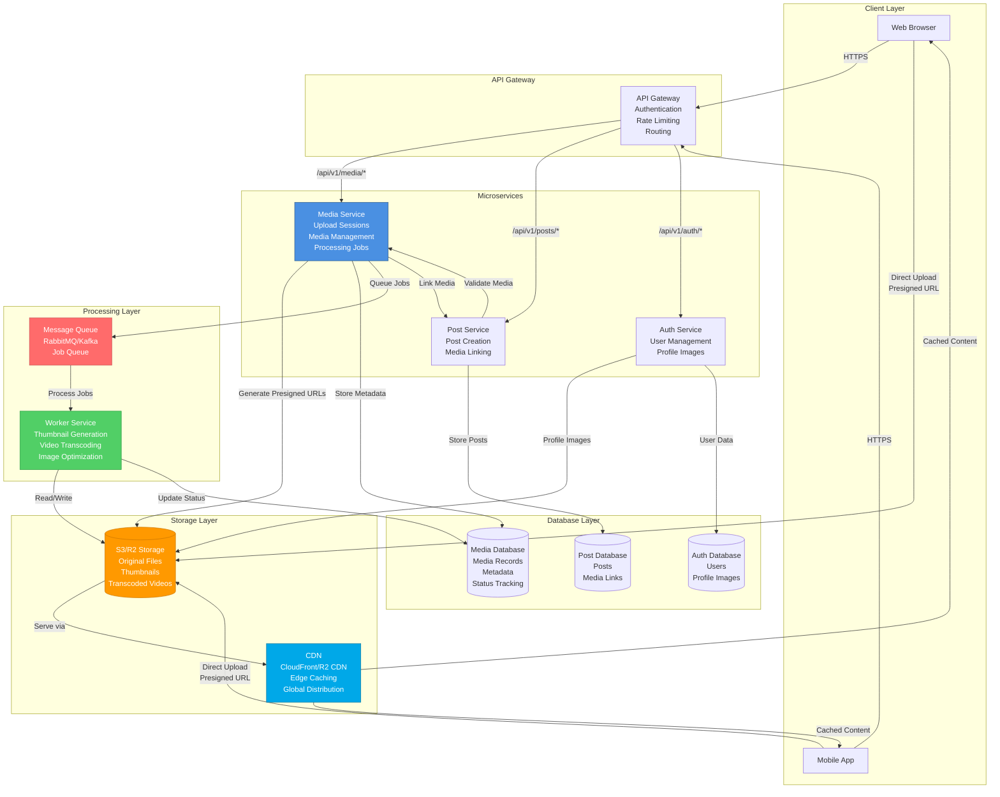
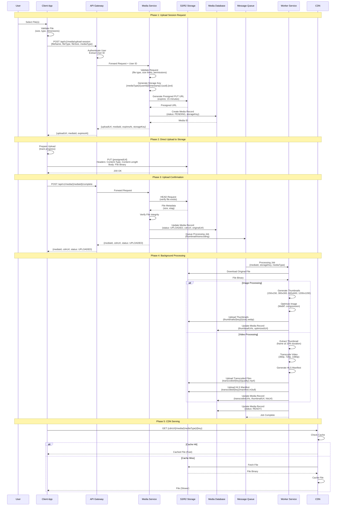
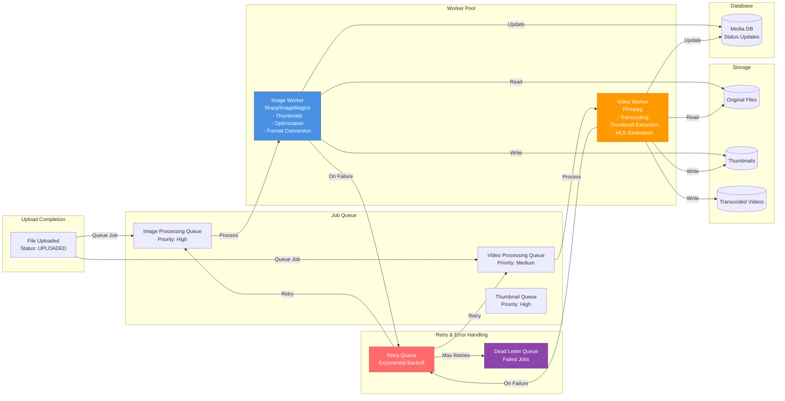
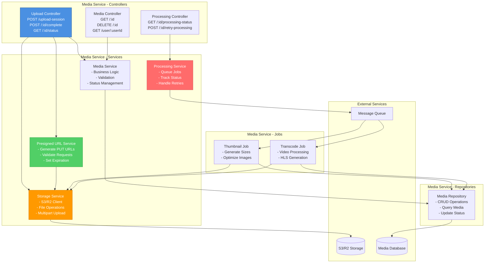
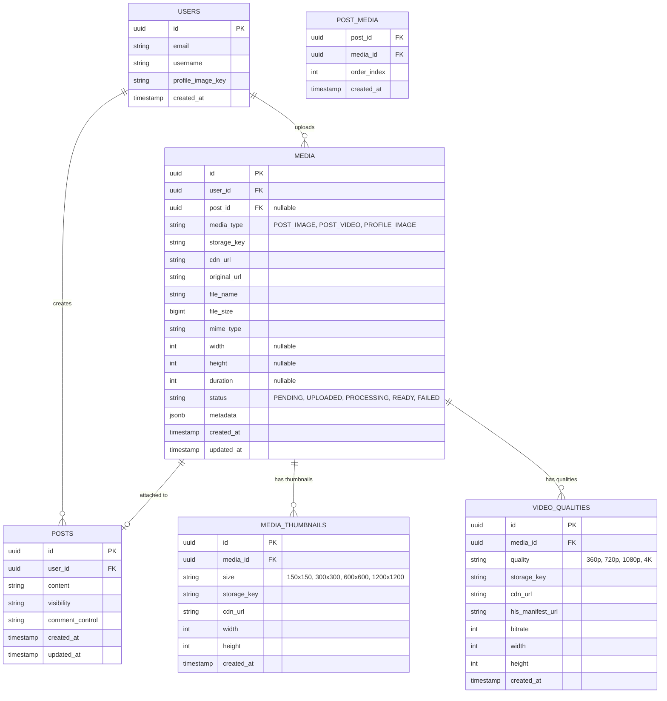
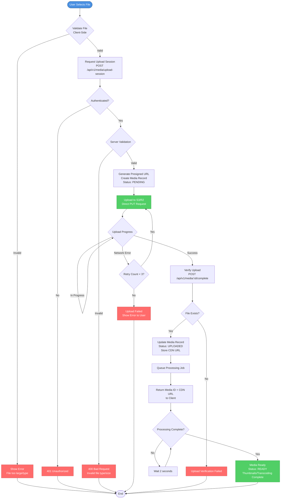
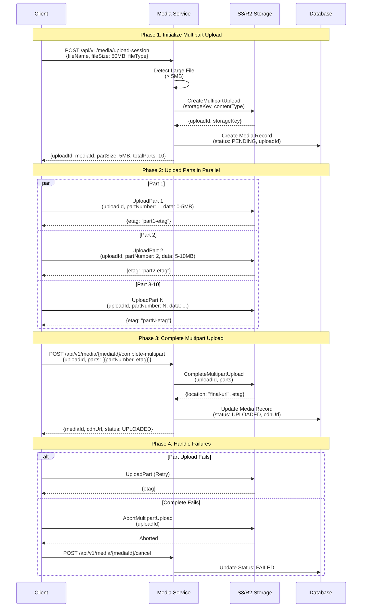
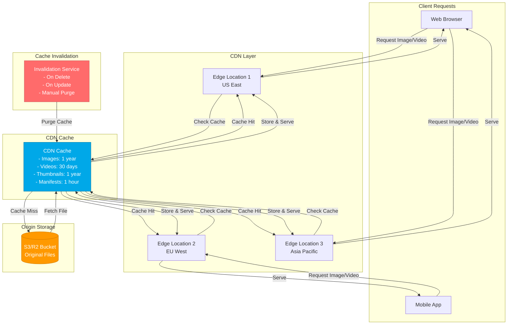
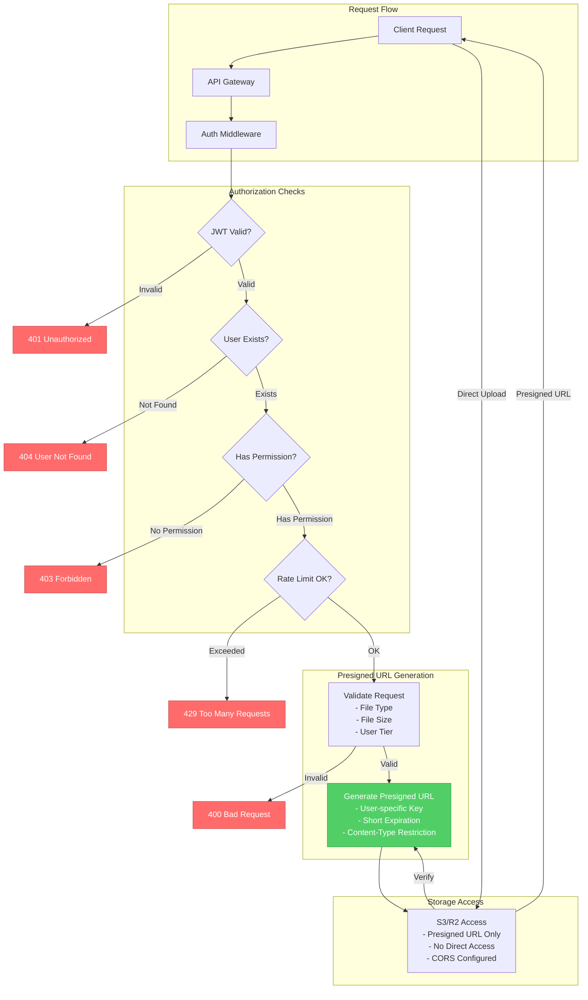
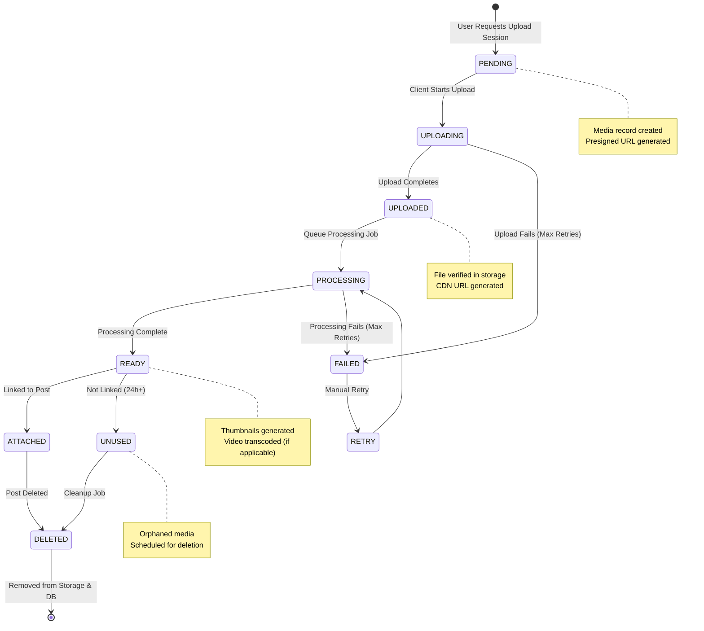

# Complete Media Upload Architecture Review & Rebuild Plan

## Executive Summary

This document provides a comprehensive analysis of your current UploadThing-based media upload implementation, identifies all architectural flaws, explains industry-standard approaches used by LinkedIn, Instagram, Facebook, and Twitter, and provides a complete migration plan to rebuild your system using production-grade patterns.

---

## 1. CURRENT IMPLEMENTATION ANALYSIS

### 1.1 Architecture Overview

Your current system uses **UploadThing** as a third-party service for media uploads:

**Client Flow:**
1. User selects files → `useMediaUpload` hook
2. Files uploaded via `useUploadThing("attachment")` → UploadThing service
3. UploadThing returns `ufsUrl` (UploadThing File Storage URL)
4. Client calls `/feed/media` to register media in your database
5. Media record created with UploadThing URL stored

**Backend Flow:**
1. Next.js API route `/api/uploadthing` handles UploadThing callbacks
2. `onUploadComplete` callback returns immediately (workaround for timeouts)
3. Client-side finalization calls Post Service `/feed/media` endpoint
4. Post Service creates Media record with UploadThing URL
5. Media linked to posts via `mediaIds` array

**Profile Images:**
- Uses **direct S3 presigned URLs** (correct approach)
- Auth Service generates presigned PUT URLs
- Client uploads directly to S3
- Profile image key stored in user record

### 1.2 Critical Architectural Flaws

#### **Flaw #1: Third-Party Dependency for Core Infrastructure**

**Problem:**
- UploadThing is a **third-party SaaS** that you don't control
- Your entire media pipeline depends on their availability, performance, and pricing
- You're locked into their infrastructure and limitations

**Why This Causes Issues:**
- **Timeout Errors**: UploadThing has strict timeout limits (10 seconds for callbacks)
- **Metadata Registration Failures**: The error you're seeing (`Failed to register metadata`) happens when UploadThing's callback to your server times out or fails
- **No Control Over CDN**: You can't optimize delivery, caching, or geographic distribution
- **Vendor Lock-in**: Migrating away requires rewriting everything
- **Cost Scaling**: Third-party services become expensive at scale

**Evidence from Your Code:**
```typescript
// client/src/app/api/uploadthing/core.ts:27-34
.onUploadComplete(({ file }) => {
  // ✅ CRITICAL FIX: Return IMMEDIATELY without any async operations
  // UploadThing times out if callback takes > 10 seconds or blocks
  // All finalization will be handled client-side in onClientUploadComplete
  
  // Return immediately - no blocking operations
  // This allows UploadThing to complete metadata registration successfully
  return { url: file.ufsUrl, name: file.name };
}),
```

This workaround exists **because UploadThing's architecture is fundamentally flawed for your use case**.

#### **Flaw #2: Split Responsibility Between Client and Server**

**Problem:**
- Upload happens via UploadThing (third-party)
- Registration happens via your API (client-side finalization)
- This creates a **two-phase commit problem** without proper transaction handling

**Why This Causes Issues:**
- **Race Conditions**: Upload completes but registration fails → orphaned files
- **Inconsistent State**: Media exists in UploadThing but not in your database
- **No Rollback**: If registration fails, UploadThing file remains (costs money, wastes storage)
- **Complex Error Handling**: Client must handle partial failures

**Evidence from Your Code:**
```typescript
// client/src/components/feed/feedEditor/Hooks/useMediaUpload.ts:45-86
onClientUploadComplete(res) {
  // Always try to finalize client-side (server callback returns immediately)
  if (!mediaId && r.ufsUrl) {
    try {
      // Client-side registration after UploadThing completes
      const finalizeRes = await fetch(`${process.env.NEXT_PUBLIC_API_URL}/feed/media`, {
        method: "POST",
        body: JSON.stringify({
          url: r.ufsUrl,
          type: isVideo ? "VIDEO" : "IMAGE",
        }),
      });
    }
  }
}
```

This is a **band-aid solution** that doesn't solve the fundamental architecture problem.

#### **Flaw #3: No Direct Control Over Storage**

**Problem:**
- Files stored in UploadThing's infrastructure
- You can't control:
  - Storage location/region
  - CDN configuration
  - Caching policies
  - Access control
  - Lifecycle management
  - Backup/restore

**Why This Causes Issues:**
- **Performance**: Can't optimize for your user base's geographic distribution
- **Compliance**: Can't guarantee data residency requirements
- **Cost**: Can't optimize storage tiers (hot/cold/archive)
- **Security**: Limited control over access policies

#### **Flaw #4: Inefficient Upload Flow**

**Problem:**
- Files go: Client → UploadThing → Your Server (callback) → Your Database
- This adds unnecessary hops and latency

**Why This Causes Issues:**
- **Latency**: Extra network hop increases upload time
- **Bandwidth Costs**: Data transits through UploadThing's servers
- **Reliability**: More points of failure
- **Scalability**: UploadThing becomes a bottleneck

**Industry Standard:**
- Client → Cloud Storage (S3/R2/GCS) directly
- Server only generates presigned URLs (no data transit)

#### **Flaw #5: Mixed Storage Systems**

**Problem:**
- Profile images: S3 (presigned URLs) ✅
- Post media: UploadThing ❌
- Two different systems for similar use cases

**Why This Causes Issues:**
- **Inconsistency**: Different code paths, different error handling
- **Complexity**: Developers must understand two systems
- **Maintenance**: Two sets of dependencies, configurations, monitoring

#### **Flaw #6: No Resumable Uploads**

**Problem:**
- UploadThing doesn't support resumable uploads for large files
- If upload fails at 90%, user must restart

**Why This Causes Issues:**
- **Poor UX**: Users lose progress on network interruptions
- **Wasted Bandwidth**: Re-uploading entire files
- **Mobile Users**: Mobile networks are unreliable, resumable uploads are critical

#### **Flaw #7: Limited File Size**

**Problem:**
- UploadThing limits: 64MB for videos, 4MB for images
- These are arbitrary limits, not based on your needs

**Why This Causes Issues:**
- **User Frustration**: Can't upload high-quality content
- **Business Limitation**: Can't support professional use cases
- **No Control**: Can't adjust limits based on user tiers

#### **Flaw #8: No Thumbnail Generation**

**Problem:**
- No automatic thumbnail generation for images/videos
- Must generate on-demand or client-side

**Why This Causes Issues:**
- **Performance**: Loading full-resolution images in feeds is slow
- **Bandwidth**: Wastes mobile data
- **UX**: Slow feed loading times

#### **Flaw #9: No Video Transcoding**

**Problem:**
- Videos stored as-is, no transcoding to multiple qualities
- Can't serve adaptive bitrate streaming

**Why This Causes Issues:**
- **Performance**: Large video files load slowly
- **Bandwidth**: Wastes data on mobile
- **Compatibility**: Some devices can't play certain formats
- **No Progressive Loading**: Can't show low-quality preview while loading

#### **Flaw #10: Weak Error Handling**

**Problem:**
- Timeout errors from UploadThing are opaque
- No retry logic
- No partial upload recovery

**Evidence from Your Logs:**
```
[13:47:44.703] ERROR (#280) handleJsonLineStream=10031ms handleUploadAction=10059ms: Failed to register metadata
  error: RequestError: Transport error (POST https://sea1.ingest.uploadthing.com/route-metadata)
  reason: 'Transport',
  [cause]: [Error [ConnectTimeoutError]: Connect Timeout Error] {
    code: 'UND_ERR_CONNECT_TIMEOUT'
  }
```

This is a **network timeout** that you can't control or retry properly.

---

## 2. INDUSTRY-STANDARD ARCHITECTURE

### 2.1 How LinkedIn, Instagram, Facebook, and Twitter Handle Media Uploads

All major social platforms use the **same fundamental pattern**:

1. **Client requests upload session** → Server generates presigned URL
2. **Client uploads directly to cloud storage** (S3, GCS, Azure Blob)
3. **Server stores metadata** after upload completes
4. **CDN serves media** with optimized caching
5. **Background processing** (thumbnails, transcoding) happens asynchronously

### 2.2 Detailed Industry Workflow

#### **Step 1: Client Requests Upload Session**

**Client:**
```typescript
// User selects file
const file = event.target.files[0];

// Request upload session from your API
const response = await fetch('/api/media/upload-session', {
  method: 'POST',
  body: JSON.stringify({
    fileName: file.name,
    fileType: file.type,
    fileSize: file.size,
    mediaType: 'POST_IMAGE' | 'POST_VIDEO' | 'PROFILE_IMAGE'
  })
});

const { uploadUrl, mediaId, expiresAt } = await response.json();
```

**Server (Media Service):**
1. Validate file (size, type, user permissions)
2. Generate unique storage key: `{mediaType}/{userId}/{timestamp}-{uuid}.{ext}`
3. Generate presigned PUT URL from S3/R2/GCS (expires in 15 minutes)
4. Create Media record in database with status `PENDING`
5. Return presigned URL + mediaId to client

**Why This Design:**
- **Security**: Server controls what can be uploaded (validation before upload)
- **Idempotency**: Media record created before upload (can track failed uploads)
- **Metadata**: Store file metadata before upload completes

#### **Step 2: Client Uploads Directly to Cloud Storage**

**Client:**
```typescript
// Upload directly to S3/R2/GCS using presigned URL
const uploadResponse = await fetch(uploadUrl, {
  method: 'PUT',
  headers: {
    'Content-Type': file.type,
    'Content-Length': file.size.toString()
  },
  body: file
});

if (!uploadResponse.ok) {
  throw new Error('Upload failed');
}

// Notify server that upload completed
await fetch(`/api/media/${mediaId}/complete`, {
  method: 'POST'
});
```

**Why Direct Upload:**
- **Performance**: No server bottleneck, direct to storage
- **Scalability**: Storage services handle millions of concurrent uploads
- **Cost**: No bandwidth costs through your servers
- **Reliability**: Storage services have 99.999999999% durability

#### **Step 3: Server Confirms Upload and Triggers Processing**

**Server (Media Service):**
1. Verify file exists in storage (HEAD request to S3)
2. Update Media record: status `UPLOADED`, store final URL
3. **Queue background job** for processing:
   - Image: Generate thumbnails (multiple sizes)
   - Video: Transcode to multiple qualities
4. Return final media URL to client

**Why Background Processing:**
- **Non-blocking**: User doesn't wait for processing
- **Scalable**: Processing happens asynchronously
- **Resilient**: Can retry failed processing jobs

#### **Step 4: CDN Serves Media**

**Architecture:**
```
User Request → CDN (CloudFront/Cloudflare) → S3/R2/GCS
```

**CDN Configuration:**
- **Caching**: Cache images for 1 year, videos for 30 days
- **Compression**: Gzip/Brotli for metadata, image optimization
- **Geographic Distribution**: Serve from edge locations
- **HTTPS**: TLS termination at CDN

**URL Structure:**
```
https://cdn.yourdomain.com/media/{mediaType}/{userId}/{fileKey}
```

**Why CDN:**
- **Performance**: 10-100x faster than direct S3 access
- **Cost**: Reduced egress costs from storage
- **Scalability**: Handles traffic spikes automatically

#### **Step 5: Media Record Storage**

**Database Schema:**
```sql
CREATE TABLE media (
  id UUID PRIMARY KEY,
  user_id UUID NOT NULL,
  media_type VARCHAR(50) NOT NULL, -- POST_IMAGE, POST_VIDEO, PROFILE_IMAGE
  storage_key VARCHAR(500) NOT NULL, -- S3 key
  cdn_url VARCHAR(500) NOT NULL, -- CDN URL
  original_url VARCHAR(500) NOT NULL, -- Direct S3 URL (fallback)
  file_name VARCHAR(255) NOT NULL,
  file_size BIGINT NOT NULL,
  mime_type VARCHAR(100) NOT NULL,
  width INT, -- For images/videos
  height INT, -- For images/videos
  duration INT, -- For videos (seconds)
  status VARCHAR(50) NOT NULL, -- PENDING, UPLOADED, PROCESSING, READY, FAILED
  thumbnail_url VARCHAR(500), -- Generated thumbnail
  transcoded_urls JSONB, -- For videos: { "360p": "url", "720p": "url", "1080p": "url" }
  metadata JSONB, -- EXIF data, etc.
  post_id UUID, -- NULL until attached to post
  created_at TIMESTAMP NOT NULL,
  updated_at TIMESTAMP NOT NULL
);

CREATE INDEX idx_media_user_id ON media(user_id);
CREATE INDEX idx_media_post_id ON media(post_id);
CREATE INDEX idx_media_status ON media(status);
CREATE INDEX idx_media_created_at ON media(created_at);
```

#### **Step 6: Large File Handling (Multipart Upload)**

**For files > 5MB, use S3 Multipart Upload:**

**Client:**
```typescript
// 1. Request multipart upload session
const { uploadId, parts } = await requestMultipartUpload(file);

// 2. Upload parts in parallel (each part max 5MB)
const uploadPromises = parts.map((part, index) => 
  uploadPart(file, part.partNumber, part.uploadUrl, index)
);

await Promise.all(uploadPromises);

// 3. Complete multipart upload
await completeMultipartUpload(uploadId, parts);
```

**Why Multipart:**
- **Resumable**: Can retry individual parts
- **Parallel**: Upload multiple parts simultaneously
- **Progress**: Track progress per part
- **Large Files**: Supports files up to 5TB

#### **Step 7: Retry Logic and Resilience**

**Client Retry Strategy:**
```typescript
async function uploadWithRetry(file: File, uploadUrl: string, maxRetries = 3) {
  for (let attempt = 1; attempt <= maxRetries; attempt++) {
    try {
      return await uploadFile(file, uploadUrl);
    } catch (error) {
      if (attempt === maxRetries) throw error;
      await delay(attempt * 1000); // Exponential backoff
    }
  }
}
```

**Server Retry Strategy:**
- **Idempotency Keys**: Prevent duplicate uploads
- **Exponential Backoff**: Retry failed processing jobs
- **Dead Letter Queue**: Store permanently failed jobs for manual review

#### **Step 8: Thumbnail Generation**

**Image Thumbnails:**
- Generate on upload: 150x150, 300x300, 600x600, 1200x1200
- Store in same bucket: `thumbnails/{originalKey}/{size}.jpg`
- Serve via CDN with aggressive caching

**Video Thumbnails:**
- Extract frame at 10% of video duration
- Generate same sizes as images
- Store alongside video

**Implementation:**
- **AWS**: Lambda + Sharp (images) or FFmpeg (videos)
- **GCP**: Cloud Functions + ImageMagick/FFmpeg
- **Self-hosted**: Worker service with Sharp/FFmpeg

#### **Step 9: Video Transcoding**

**Transcoding Pipeline:**
1. Upload original video → S3
2. Trigger transcoding job (Lambda/Cloud Function/Worker)
3. Transcode to multiple qualities:
   - 360p (mobile, low bandwidth)
   - 720p (standard)
   - 1080p (high quality)
   - 4K (if original is 4K)
4. Store transcoded files in S3
5. Update Media record with transcoded URLs

**Adaptive Bitrate Streaming:**
- Generate HLS (HTTP Live Streaming) or DASH manifest
- Client selects quality based on bandwidth
- Smooth playback with automatic quality adjustment

**Tools:**
- **AWS**: MediaConvert, Elastic Transcoder
- **GCP**: Transcoder API
- **Self-hosted**: FFmpeg in worker service

#### **Step 10: Metadata Storage**

**Store in Media Record:**
- **Images**: EXIF data (camera, location, timestamp), dimensions, file size
- **Videos**: Duration, codec, bitrate, resolution, frame rate
- **Both**: Upload timestamp, processing status, CDN URLs

**Why Store Metadata:**
- **Search**: Find media by properties
- **Analytics**: Track usage patterns
- **Compliance**: Audit trail
- **Optimization**: Make decisions based on file characteristics

### 2.3 Microservice Integration

**Media Service Responsibilities:**
- Generate presigned URLs
- Store media metadata
- Trigger processing jobs
- Serve media URLs
- Handle media lifecycle (delete, replace)

**Post Service Responsibilities:**
- Link media to posts (via `mediaIds`)
- Validate media ownership
- Handle post deletion (cascade to media cleanup)

**API Gateway Responsibilities:**
- Route `/api/media/*` → Media Service
- Route `/api/posts/*` → Post Service
- Handle authentication/authorization

**Communication:**
- **Synchronous**: HTTP/gRPC for upload session requests
- **Asynchronous**: Message queue (RabbitMQ/Kafka) for processing jobs

---

## 3. REBUILD INSTRUCTIONS (NO CODE)

### 3.1 Recommended Storage Solution

**Option 1: AWS S3 + CloudFront (Recommended for Production)**
- **Pros**: Mature, reliable, excellent CDN integration, global infrastructure
- **Cons**: Can be expensive at scale, complex pricing
- **Best For**: Production systems with global user base

**Option 2: Cloudflare R2 + Cloudflare CDN**
- **Pros**: No egress fees, excellent CDN, simple pricing, S3-compatible API
- **Cons**: Newer service, less mature than S3
- **Best For**: Cost-conscious startups, high-traffic applications

**Option 3: Google Cloud Storage + Cloud CDN**
- **Pros**: Excellent integration with GCP services, competitive pricing
- **Cons**: Less common than AWS, vendor lock-in
- **Best For**: Teams already using GCP

**Recommendation**: Start with **Cloudflare R2** (cost-effective, S3-compatible) or **AWS S3** (if you need AWS ecosystem integration).

### 3.2 Build a Dedicated Media Service

**Service Structure:**
```
media-service/
├── src/
│   ├── controllers/
│   │   ├── upload.controller.ts      # Handle upload session requests
│   │   ├── media.controller.ts        # CRUD operations
│   │   └── processing.controller.ts   # Processing status/webhooks
│   ├── services/
│   │   ├── storage.service.ts         # S3/R2 operations
│   │   ├── presigned-url.service.ts   # Generate presigned URLs
│   │   ├── media.service.ts           # Business logic
│   │   └── processing.service.ts      # Thumbnail/transcoding
│   ├── repositories/
│   │   └── media.repository.ts        # Database operations
│   ├── jobs/
│   │   ├── thumbnail.job.ts           # Image thumbnail generation
│   │   └── transcoding.job.ts         # Video transcoding
│   └── grpc/
│       └── media.proto                # gRPC service definition
```

**Responsibilities:**
1. **Upload Session Management**
   - Validate file metadata
   - Generate presigned URLs
   - Create Media records

2. **Storage Operations**
   - Direct S3/R2 uploads
   - Multipart upload support
   - File verification

3. **Processing Pipeline**
   - Queue thumbnail jobs
   - Queue transcoding jobs
   - Update Media records with processed URLs

4. **Media Lifecycle**
   - Delete unused media
   - Replace media (profile images)
   - Archive old media

### 3.3 API Gateway Integration

**Route Configuration:**
```
POST   /api/v1/media/upload-session    → Media Service
POST   /api/v1/media/:id/complete      → Media Service
GET    /api/v1/media/:id               → Media Service
DELETE /api/v1/media/:id               → Media Service
```

**Middleware:**
- **Authentication**: Verify JWT, extract user ID
- **Rate Limiting**: Limit upload requests per user
- **Validation**: Validate request body
- **Logging**: Log all media operations

**Proxy Configuration:**
- Forward authenticated requests to Media Service
- Handle errors and retries
- Add CORS headers for CDN requests

### 3.4 Generate Presigned URL Upload Sessions

**Flow:**
1. Client sends file metadata (name, type, size)
2. Media Service validates:
   - File type allowed
   - File size within limits
   - User has permission
3. Generate storage key: `{mediaType}/{userId}/{timestamp}-{uuid}.{ext}`
4. Generate presigned PUT URL (expires in 15 minutes)
5. Create Media record with status `PENDING`
6. Return `{ uploadUrl, mediaId, expiresAt }`

**Security:**
- **Content-Type Validation**: Enforce MIME type in presigned URL
- **File Size Limits**: Enforce max size in presigned URL
- **Expiration**: Short expiration (15 minutes) to prevent URL reuse
- **User Isolation**: Storage keys include user ID

### 3.5 Frontend Upload Implementation

**Upload Hook:**
```typescript
// useDirectUpload.ts
1. Request upload session from Media Service
2. Upload file directly to presigned URL (S3/R2)
3. Track upload progress (XMLHttpRequest or Fetch API with ReadableStream)
4. Notify Media Service when upload completes
5. Poll for processing status (thumbnails/transcoding)
6. Return final media URL
```

**Features:**
- **Progress Tracking**: Show upload percentage
- **Retry Logic**: Automatically retry failed uploads
- **Multipart Support**: For large files
- **Preview**: Show preview before upload completes
- **Error Handling**: Clear error messages

**Components:**
- `MediaUploader`: File input + upload logic
- `UploadProgress`: Progress bar component
- `MediaPreview`: Preview uploaded media

### 3.6 Store Final File URL in Post Service

**Flow:**
1. User uploads media → Media Service returns `mediaId`
2. User creates post with `mediaIds: [mediaId1, mediaId2]`
3. Post Service validates:
   - Media exists
   - Media belongs to user
   - Media is not already attached to another post
4. Create Post record
5. Link Media records to Post (update `postId` in Media table)

**Transaction:**
- Use database transaction to ensure atomicity
- If post creation fails, media remains unlinked (cleanup job handles)

### 3.7 Handle Profile Images vs Post Media

**Profile Images:**
- **Storage Path**: `profiles/{userId}/{timestamp}-{uuid}.jpg`
- **Processing**: Generate thumbnails (150x150, 300x300)
- **Replacement**: Delete old profile image when new one uploaded
- **CDN**: Aggressive caching (1 year)

**Post Media:**
- **Storage Path**: `posts/{userId}/{timestamp}-{uuid}.{ext}`
- **Processing**: 
  - Images: Thumbnails + multiple sizes
  - Videos: Transcoding + thumbnails
- **CDN**: Moderate caching (30 days for images, 7 days for videos)

**Implementation:**
- Same Media Service, different `mediaType` enum
- Different processing pipelines based on type
- Different cleanup policies

### 3.8 Handle Videos (Transcoding Strategy)

**Option 1: Transcode on Upload (Recommended)**
- Upload original → Queue transcoding job
- Transcode to multiple qualities
- Store all qualities in S3
- Serve appropriate quality based on client

**Option 2: Transcode on Demand**
- Store original only
- Transcode when first requested
- Cache transcoded version
- **Not Recommended**: Slow first load, unpredictable costs

**Implementation:**
- **Worker Service**: Dedicated service for transcoding
- **Queue**: RabbitMQ/Kafka for job queue
- **FFmpeg**: Industry-standard transcoding tool
- **HLS/DASH**: Generate adaptive bitrate streams

**Quality Levels:**
- 360p: Mobile, low bandwidth
- 720p: Standard quality
- 1080p: High quality
- 4K: If original is 4K

### 3.9 Caching and CDN Configuration

**CDN Setup:**
1. Create CloudFront/R2 CDN distribution
2. Point to S3/R2 bucket
3. Configure caching rules:
   - Images: Cache for 1 year
   - Videos: Cache for 30 days
   - Thumbnails: Cache for 1 year
4. Enable compression (Gzip/Brotli)
5. Configure HTTPS (TLS 1.2+)

**Cache Headers:**
```
Cache-Control: public, max-age=31536000, immutable
Content-Type: image/jpeg
ETag: "file-hash"
```

**Invalidation:**
- Invalidate CDN cache when media is deleted
- Use versioned URLs (include hash in filename) to avoid invalidation

### 3.10 Media Lifecycle Management

**Delete Unused Media:**
- **Cron Job**: Run daily
- Find media with `postId IS NULL` and `createdAt > 24 hours ago`
- Delete from storage (S3/R2)
- Delete database record

**Replace Media:**
- **Profile Images**: Delete old image when new one uploaded
- **Post Media**: Keep old versions for edit history (optional)

**Archive Old Media:**
- Move to Glacier/Archive storage after 1 year of no access
- Reduce storage costs
- Restore on-demand if needed

**Expiration:**
- Set expiration on presigned URLs (15 minutes)
- Clean up expired upload sessions

---

## 4. FULL MIGRATION PLAN

### 4.1 Phase 1: Infrastructure Setup (Week 1)

**Tasks:**
1. **Set up Cloud Storage**
   - Create S3 bucket or R2 bucket
   - Configure CORS for direct uploads
   - Set up IAM/API keys
   - Configure bucket policies

2. **Set up CDN**
   - Create CloudFront/R2 CDN distribution
   - Point to storage bucket
   - Configure caching rules
   - Set up custom domain (optional)

3. **Create Media Service**
   - Initialize new microservice
   - Set up database schema (Media table)
   - Configure gRPC service
   - Set up message queue (for processing jobs)

4. **Update API Gateway**
   - Add routes for Media Service
   - Configure proxy middleware
   - Update authentication middleware

**Deliverables:**
- Storage bucket configured
- CDN distribution active
- Media Service skeleton
- API Gateway routes configured

### 4.2 Phase 2: Core Upload Implementation (Week 2)

**Tasks:**
1. **Implement Presigned URL Generation**
   - Storage service (S3/R2 client)
   - Presigned URL service
   - Validation logic
   - Media record creation

2. **Implement Direct Upload (Client)**
   - Upload session request
   - Direct S3/R2 upload
   - Progress tracking
   - Upload completion notification

3. **Implement Upload Confirmation (Server)**
   - Verify file in storage
   - Update Media record
   - Return final URL

4. **Testing**
   - Unit tests for services
   - Integration tests for upload flow
   - Load testing for concurrent uploads

**Deliverables:**
- Working direct upload flow
- Media records in database
- CDN URLs returned to client

### 4.3 Phase 3: Processing Pipeline (Week 3)

**Tasks:**
1. **Thumbnail Generation**
   - Worker service for image processing
   - Generate multiple sizes
   - Store thumbnails in S3
   - Update Media record

2. **Video Transcoding (Optional)**
   - Set up FFmpeg worker
   - Transcode to multiple qualities
   - Generate HLS/DASH manifests
   - Update Media record

3. **Job Queue**
   - Set up RabbitMQ/Kafka
   - Queue processing jobs
   - Handle job failures/retries

**Deliverables:**
- Thumbnail generation working
- Processing jobs queued and executed
- Media records updated with processed URLs

### 4.4 Phase 4: Integration with Post Service (Week 4)

**Tasks:**
1. **Update Post Service**
   - Modify post creation to use `mediaIds`
   - Validate media ownership
   - Link media to posts
   - Handle media deletion on post delete

2. **Update Client**
   - Replace UploadThing with direct upload
   - Update post creation flow
   - Update media display components

3. **Migration Script**
   - Migrate existing UploadThing URLs to new system (optional)
   - Update database records
   - Handle legacy URLs

**Deliverables:**
- Posts created with new media system
- Media linked to posts correctly
- Legacy URLs handled (if migrating)

### 4.5 Phase 5: Cleanup and Optimization (Week 5)

**Tasks:**
1. **Remove UploadThing**
   - Delete UploadThing API routes
   - Remove UploadThing dependencies
   - Delete UploadThing configuration

2. **Implement Lifecycle Management**
   - Unused media cleanup job
   - Media replacement logic
   - Archive old media

3. **Monitoring and Logging**
   - Set up metrics (upload success rate, processing time)
   - Set up alerts (failed uploads, processing failures)
   - Log all media operations

4. **Performance Optimization**
   - Optimize CDN caching
   - Optimize database queries
   - Optimize processing pipeline

**Deliverables:**
- UploadThing completely removed
- Lifecycle management working
- Monitoring and alerts configured
- System optimized

### 4.6 Files to Delete

**Client:**
- `client/src/app/api/uploadthing/route.ts`
- `client/src/app/api/uploadthing/core.ts`
- `client/src/app/lib/uploadthing.ts`
- `client/src/components/feed/feedEditor/Hooks/useMediaUpload.ts` (rewrite)
- `client/src/components/projects/hooks/useProjectMediaUpload.ts` (rewrite)
- UploadThing dependencies from `package.json`

**Post Service:**
- `post-service/src/repositories/impliments/media.repository.ts` (remove UTApi usage)
- UploadThing dependencies from `package.json`

**Configuration:**
- UploadThing environment variables
- UploadThing API keys

### 4.7 Files to Create

**Media Service (New Microservice):**
- `media-service/src/controllers/upload.controller.ts`
- `media-service/src/controllers/media.controller.ts`
- `media-service/src/services/storage.service.ts`
- `media-service/src/services/presigned-url.service.ts`
- `media-service/src/services/media.service.ts`
- `media-service/src/repositories/media.repository.ts`
- `media-service/src/jobs/thumbnail.job.ts`
- `media-service/src/jobs/transcoding.job.ts`
- `media-service/protos/media.proto`
- `media-service/prisma/schema.prisma`

**Client:**
- `client/src/hooks/useDirectUpload.ts`
- `client/src/services/api/media.service.ts`
- `client/src/components/media/MediaUploader.tsx`
- `client/src/components/media/UploadProgress.tsx`

**API Gateway:**
- `api-gateway/src/middleware/media.proxy.middleware.ts`
- `api-gateway/src/constants/routes.ts` (add media routes)

### 4.8 Gradual Migration Strategy

**Option 1: Big Bang (Recommended for Small User Base)**
- Deploy new system
- Switch all users at once
- Monitor closely for issues
- Rollback plan ready

**Option 2: Feature Flag (Recommended for Large User Base)**
- Deploy new system alongside old
- Use feature flag to route users
- Gradually increase percentage
- Monitor metrics for both systems
- Switch fully when confident

**Option 3: Gradual Rollout**
- New users → New system
- Existing users → Old system (temporarily)
- Migrate existing users over time
- Deprecate old system

---

## 5. OFFICIAL DOCUMENTATION LINKS

### 5.1 AWS S3 Pre-Signed Uploads

**Primary Documentation:**
- **Pre-Signed URLs**: https://docs.aws.amazon.com/AmazonS3/latest/userguide/PresignedUrlUploadObject.html
- **Pre-Signed POST**: https://docs.aws.amazon.com/AmazonS3/latest/userguide/PresignedPostUpload.html
- **S3 SDK (Node.js)**: https://docs.aws.amazon.com/sdk-for-javascript/v3/developer-guide/s3-example-creating-buckets.html

**Key Concepts:**
- Presigned URLs expire (set expiration based on use case)
- Content-Type validation prevents type spoofing
- File size limits can be enforced
- CORS must be configured for browser uploads

### 5.2 AWS S3 Multipart Upload (Large Files)

**Primary Documentation:**
- **Multipart Upload Overview**: https://docs.aws.amazon.com/AmazonS3/latest/userguide/mpuoverview.html
- **Multipart Upload API**: https://docs.aws.amazon.com/AmazonS3/latest/API/API_CreateMultipartUpload.html
- **Multipart Upload Best Practices**: https://docs.aws.amazon.com/AmazonS3/latest/userguide/mpuoverview.html#mpu-best-practices

**Key Concepts:**
- Use for files > 5MB
- Upload parts in parallel for speed
- Parts can be retried individually
- Complete multipart upload after all parts uploaded

### 5.3 Cloudflare R2 Direct Uploads

**Primary Documentation:**
- **R2 Presigned URLs**: https://developers.cloudflare.com/r2/api/s3/presigned-urls/
- **R2 S3 Compatibility**: https://developers.cloudflare.com/r2/api/s3/
- **R2 Direct Uploads**: https://developers.cloudflare.com/r2/examples/direct-uploads/

**Key Concepts:**
- S3-compatible API (can use AWS SDK)
- No egress fees (major cost advantage)
- Presigned URLs work same as S3
- Excellent CDN integration

### 5.4 Google Cloud Storage Signed URLs

**Primary Documentation:**
- **Signed URLs**: https://cloud.google.com/storage/docs/access-control/signed-urls
- **Signed URLs v4**: https://cloud.google.com/storage/docs/access-control/signing-urls-with-helpers
- **Node.js Client**: https://cloud.google.com/nodejs/docs/reference/storage/latest

**Key Concepts:**
- v4 signed URLs recommended (more secure)
- Can sign with service account or user credentials
- Supports expiration and access conditions

### 5.5 Content Delivery (CDN) Best Practices

**Primary Documentation:**
- **Cloudflare Cache**: https://developers.cloudflare.com/cache/
- **AWS CloudFront Caching**: https://docs.aws.amazon.com/AmazonCloudFront/latest/DeveloperGuide/WorkingWithDownloadDistributions.html
- **CDN Performance**: https://web.dev/fast/#optimize-your-images

**Key Concepts:**
- Cache static assets aggressively (1 year)
- Use versioned URLs to avoid cache invalidation
- Enable compression (Gzip/Brotli)
- Configure proper cache headers

### 5.6 Image Optimization Best Practices

**Primary Documentation:**
- **Web.dev Image Optimization**: https://web.dev/fast/#images
- **Responsive Images**: https://web.dev/fast/#serve-responsive-images
- **Image Formats**: https://web.dev/fast/#use-modern-image-formats

**Key Concepts:**
- Generate multiple sizes (thumbnail, small, medium, large)
- Use modern formats (WebP, AVIF) with fallbacks
- Lazy load images below the fold
- Serve appropriate size based on device/viewport

### 5.7 Video Transcoding Workflow

**Primary Documentation:**
- **AWS MediaConvert**: https://docs.aws.amazon.com/mediaconvert/latest/ug/what-is.html
- **FFmpeg Documentation**: https://ffmpeg.org/documentation.html
- **HLS Streaming**: https://developer.apple.com/streaming/

**Key Concepts:**
- Transcode to multiple qualities (360p, 720p, 1080p)
- Generate HLS or DASH for adaptive bitrate
- Extract thumbnails from videos
- Process asynchronously (don't block upload)

### 5.8 LinkedIn Engineering – Media Uploading & Processing

**Primary Resources:**
- **LinkedIn Engineering Blog**: https://engineering.linkedin.com/blog
- **Search for**: "media", "upload", "storage", "CDN"

**Key Articles (if available):**
- Media upload architecture
- CDN optimization strategies
- Image processing pipelines

### 5.9 Instagram Engineering – Media Processing

**Primary Resources:**
- **Instagram Engineering Blog**: https://instagram-engineering.com/
- **Search for**: "media", "image processing", "video", "storage"

**Key Articles (if available):**
- Image processing at scale
- Video transcoding architecture
- CDN strategies

### 5.10 Twitter Engineering – Image/Video Pipeline

**Primary Resources:**
- **Twitter Engineering Blog**: https://blog.twitter.com/engineering/en_us
- **Search for**: "media", "image", "video", "upload"

**Key Articles (if available):**
- Media upload infrastructure
- Video processing pipeline
- CDN optimization

---

## 6. ADDITIONAL BEST PRACTICES

### 6.1 Security

**File Validation:**
- Validate file type (MIME type, not just extension)
- Validate file size (server-side, not just client)
- Scan for malware (optional, for user uploads)
- Sanitize filenames (prevent path traversal)

**Access Control:**
- Presigned URLs should be user-specific
- Verify user owns media before serving
- Implement rate limiting (prevent abuse)
- Log all media operations for audit

### 6.2 Performance

**Upload Optimization:**
- Use multipart upload for files > 5MB
- Upload parts in parallel
- Compress images before upload (client-side)
- Show progress to users

**Serving Optimization:**
- Use CDN for all media
- Generate and cache thumbnails
- Serve appropriate size based on context
- Lazy load media below the fold

### 6.3 Monitoring

**Metrics to Track:**
- Upload success rate
- Upload duration (p50, p95, p99)
- Processing job success rate
- CDN cache hit rate
- Storage costs
- Error rates by type

**Alerts:**
- Upload failure rate > 5%
- Processing job failure rate > 10%
- Storage costs spike
- CDN cache hit rate < 80%

### 6.4 Cost Optimization

**Storage:**
- Use appropriate storage class (Standard, Infrequent Access, Archive)
- Delete unused media promptly
- Archive old media to cheaper storage
- Compress images/videos

**CDN:**
- Optimize cache hit rate
- Use appropriate cache TTL
- Minimize cache invalidation
- Monitor egress costs

**Processing:**
- Process only when needed
- Use spot instances for processing (if self-hosted)
- Batch processing jobs
- Optimize transcoding settings

---

## 7. CONCLUSION

Your current UploadThing-based implementation has fundamental architectural flaws that cause the issues you're experiencing:

1. **Third-party dependency** for core infrastructure
2. **Split responsibility** between client and server
3. **No control** over storage and CDN
4. **Inefficient upload flow** with unnecessary hops
5. **No resumable uploads** for large files
6. **Limited file sizes** and processing capabilities

The industry-standard approach used by LinkedIn, Instagram, Facebook, and Twitter is:

1. **Direct uploads** to cloud storage (S3/R2/GCS) via presigned URLs
2. **CDN serving** for optimal performance
3. **Background processing** for thumbnails and transcoding
4. **Full control** over infrastructure and costs

**Next Steps:**
1. Review this document with your team
2. Choose storage solution (recommend Cloudflare R2 or AWS S3)
3. Follow the migration plan phase by phase
4. Reference the official documentation links for implementation details
5. Test thoroughly before full rollout

**Estimated Timeline:** 5 weeks for complete migration

**Estimated Effort:** 2-3 developers full-time

---

## 8. DETAILED ARCHITECTURE DIAGRAMS

### 8.1 High-Level System Architecture



### 8.2 Detailed Upload Flow Sequence Diagram



### 8.3 Processing Pipeline Architecture



### 8.4 Component Architecture - Media Service



### 8.5 Database Schema Relationships



### 8.6 Complete Upload Flow with Error Handling



### 8.7 Multipart Upload Flow (Large Files > 5MB)



### 8.8 CDN and Caching Strategy



### 8.9 Security and Access Control Flow



### 8.10 Media Lifecycle Management



---

Good luck with your migration! 🚀

