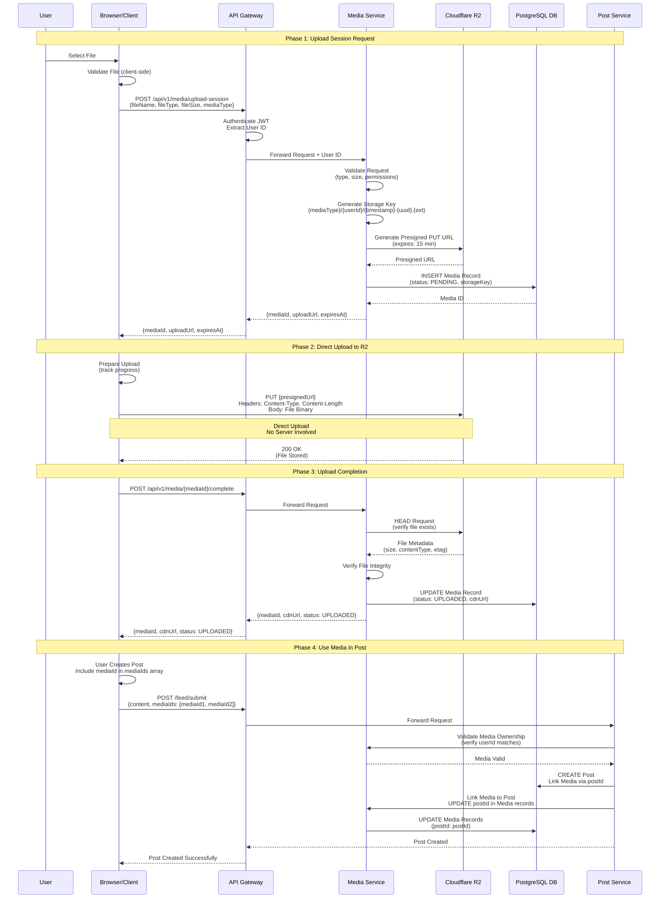

# Media Upload System - Complete Working Flow Chart

## Complete Upload Flow (Step-by-Step)

```mermaid
flowchart TD
    START([User Selects File in Browser]) --> VALIDATE_CLIENT{Client Validates File<br/>- File Type<br/>- File Size<br/>- Dimensions}
    
    VALIDATE_CLIENT -->|Invalid| ERROR_CLIENT[Show Error to User<br/>File too large or invalid type]
    VALIDATE_CLIENT -->|Valid| REQUEST_SESSION[Client: Request Upload Session<br/>POST /api/v1/media/upload-session<br/>{fileName, fileType, fileSize, mediaType}]
    
    REQUEST_SESSION --> GATEWAY_AUTH[API Gateway: Authenticate User<br/>Extract JWT Token<br/>Verify User ID]
    
    GATEWAY_AUTH -->|Not Authenticated| ERROR_AUTH[401 Unauthorized]
    GATEWAY_AUTH -->|Authenticated| FORWARD_SESSION[API Gateway: Forward Request<br/>Add User ID to Headers<br/>POST → Media Service]
    
    FORWARD_SESSION --> MEDIA_VALIDATE[Media Service: Validate Request<br/>- Check file type allowed<br/>- Check file size limits<br/>- Verify user permissions]
    
    MEDIA_VALIDATE -->|Invalid| ERROR_VALIDATE[400 Bad Request<br/>Return Error to Client]
    MEDIA_VALIDATE -->|Valid| GENERATE_KEY[Media Service: Generate Storage Key<br/>Format: {mediaType}/{userId}/{timestamp}-{uuid}.{ext}<br/>Example: post-image/user123/1763446881194-abc123.jpg]
    
    GENERATE_KEY --> CHECK_SIZE{File Size > 5MB?}
    
    CHECK_SIZE -->|Yes| INIT_MULTIPART[Media Service: Initialize Multipart Upload<br/>CreateMultipartUpload to R2<br/>Get uploadId]
    CHECK_SIZE -->|No| GENERATE_PRESIGNED[Media Service: Generate Presigned PUT URL<br/>Using AWS SDK getSignedUrl<br/>Expires in 15 minutes]
    
    INIT_MULTIPART --> CREATE_MEDIA_RECORD_MULTI[Media Service: Create Media Record in DB<br/>Status: PENDING<br/>Store: storageKey, uploadId]
    
    GENERATE_PRESIGNED --> CREATE_MEDIA_RECORD[Media Service: Create Media Record in DB<br/>Status: PENDING<br/>Store: storageKey]
    
    CREATE_MEDIA_RECORD_MULTI --> RETURN_SESSION_MULTI[Media Service: Return Upload Session<br/>{mediaId, uploadUrl, uploadId, partSize, totalParts}]
    
    CREATE_MEDIA_RECORD --> RETURN_SESSION[Media Service: Return Upload Session<br/>{mediaId, uploadUrl, expiresAt}]
    
    RETURN_SESSION_MULTI --> CLIENT_RECEIVE_MULTI[Client: Receive Upload Session<br/>Store mediaId, uploadUrl, uploadId]
    RETURN_SESSION --> CLIENT_RECEIVE[Client: Receive Upload Session<br/>Store mediaId, uploadUrl]
    
    CLIENT_RECEIVE_MULTI --> UPLOAD_PARTS[Client: Upload Parts in Parallel<br/>For each part:<br/>PUT {presignedPartUrl}<br/>Body: File chunk<br/>Track progress per part]
    
    CLIENT_RECEIVE --> UPLOAD_DIRECT[Client: Upload File Directly to R2<br/>PUT {presignedUrl}<br/>Headers: Content-Type, Content-Length<br/>Body: File binary<br/>Track upload progress]
    
    UPLOAD_PARTS --> COLLECT_ETAGS[Client: Collect ETags from All Parts<br/>Store: [{partNumber, etag}, ...]]
    
    COLLECT_ETAGS --> COMPLETE_MULTIPART[Client: Complete Multipart Upload<br/>POST /api/v1/media/{mediaId}/complete-multipart<br/>{uploadId, parts: [{partNumber, etag}]}]
    
    UPLOAD_DIRECT -->|Success| VERIFY_UPLOAD[Client: Verify Upload Complete<br/>POST /api/v1/media/{mediaId}/complete<br/>Notify server upload finished]
    
    UPLOAD_DIRECT -->|Network Error| RETRY_CHECK{Retry Count < 3?}
    RETRY_CHECK -->|Yes| UPLOAD_DIRECT
    RETRY_CHECK -->|No| ERROR_UPLOAD[Upload Failed<br/>Show Error to User]
    
    COMPLETE_MULTIPART --> MEDIA_VERIFY_MULTIPART[Media Service: Complete Multipart Upload<br/>Call R2 CompleteMultipartUpload<br/>Verify all parts uploaded]
    
    VERIFY_UPLOAD --> GATEWAY_COMPLETE[API Gateway: Forward Complete Request<br/>POST → Media Service]
    
    GATEWAY_COMPLETE --> MEDIA_VERIFY[Media Service: Verify File Exists<br/>HEAD request to R2<br/>Check file metadata]
    
    MEDIA_VERIFY_MULTIPART --> UPDATE_MEDIA_MULTIPART[Media Service: Update Media Record<br/>Status: UPLOADED<br/>Store: cdnUrl, originalUrl]
    
    MEDIA_VERIFY -->|File Not Found| ERROR_VERIFY[404 File Not Found<br/>Upload may have failed]
    MEDIA_VERIFY -->|File Exists| GET_METADATA[Media Service: Get File Metadata from R2<br/>- File size<br/>- Content type<br/>- ETag]
    
    GET_METADATA --> UPDATE_MEDIA[Media Service: Update Media Record<br/>Status: UPLOADED<br/>Store: cdnUrl, originalUrl, fileSize]
    
    UPDATE_MEDIA_MULTIPART --> QUEUE_PROCESSING[Media Service: Queue Processing Job<br/>For thumbnails/transcoding<br/>Status: PROCESSING]
    
    UPDATE_MEDIA --> QUEUE_PROCESSING
    
    QUEUE_PROCESSING --> RETURN_COMPLETE[Media Service: Return Completion Response<br/>{mediaId, cdnUrl, status: UPLOADED}]
    
    RETURN_COMPLETE --> CLIENT_SUCCESS[Client: Receive Upload Success<br/>Store: mediaId, cdnUrl<br/>Show success message]
    
    CLIENT_SUCCESS --> USE_MEDIA[Client: Use Media in Post Creation<br/>Pass mediaId to Post Service<br/>When creating post]
    
    USE_MEDIA --> POST_CREATE[Post Service: Create Post with mediaIds<br/>Validate media ownership<br/>Link media to post via postId]
    
    POST_CREATE --> MEDIA_LINK[Media Service: Link Media to Post<br/>Update postId in Media records<br/>Status: READY]
    
    MEDIA_LINK --> POST_SUCCESS[Post Created Successfully<br/>Media attached and ready]
    
    ERROR_CLIENT --> END([End])
    ERROR_AUTH --> END
    ERROR_VALIDATE --> END
    ERROR_UPLOAD --> END
    ERROR_VERIFY --> END
    POST_SUCCESS --> END
    
    style START fill:#4A90E2,stroke:#2E5C8A,color:#fff
    style UPLOAD_DIRECT fill:#51CF66,stroke:#2F9E44,color:#fff
    style UPLOAD_PARTS fill:#51CF66,stroke:#2F9E44,color:#fff
    style CLIENT_SUCCESS fill:#51CF66,stroke:#2F9E44,color:#fff
    style POST_SUCCESS fill:#51CF66,stroke:#2F9E44,color:#fff
    style ERROR_CLIENT fill:#FF6B6B,stroke:#CC5555,color:#fff
    style ERROR_AUTH fill:#FF6B6B,stroke:#CC5555,color:#fff
    style ERROR_VALIDATE fill:#FF6B6B,stroke:#CC5555,color:#fff
    style ERROR_UPLOAD fill:#FF6B6B,stroke:#CC5555,color:#fff
    style ERROR_VERIFY fill:#FF6B6B,stroke:#CC5555,color:#fff
    style GENERATE_PRESIGNED fill:#FFD93D,stroke:#F39C12,color:#000
    style CREATE_MEDIA_RECORD fill:#FFD93D,stroke:#F39C12,color:#000
    style MEDIA_VERIFY fill:#FFD93D,stroke:#F39C12,color:#000
```

## Component Interaction Flow



## Data Flow Diagram

```mermaid
graph LR
    subgraph "Client Side"
        FILE[File Selected<br/>image.jpg<br/>2.5 MB]
        HOOK[useDirectUpload Hook]
        API[Media Service API]
    end

    subgraph "API Gateway"
        AUTH[Authentication<br/>JWT Verification]
        PROXY[Media Proxy<br/>Route Forwarding]
    end

    subgraph "Media Service"
        VALIDATE[Validation Service<br/>- File Type Check<br/>- Size Limits<br/>- Permissions]
        PRESIGNED[Presigned URL Service<br/>Generate PUT URL]
        STORAGE[Storage Service<br/>R2 Operations]
        MEDIA_SVC[Media Service<br/>Business Logic]
        REPO[Media Repository<br/>Database Operations]
    end

    subgraph "Cloudflare R2"
        BUCKET[R2 Bucket<br/>File Storage]
        CDN[CDN Distribution<br/>Global Delivery]
    end

    subgraph "Database"
        MEDIA_DB[(Media Table<br/>- id<br/>- storageKey<br/>- cdnUrl<br/>- status)]
    end

    FILE -->|1. File Selected| HOOK
    HOOK -->|2. Request Session| API
    API -->|3. POST /upload-session| AUTH
    AUTH -->|4. Authenticated| PROXY
    PROXY -->|5. Forward Request| VALIDATE
    VALIDATE -->|6. Valid| PRESIGNED
    PRESIGNED -->|7. Generate URL| STORAGE
    STORAGE -->|8. Create Presigned URL| BUCKET
    PRESIGNED -->|9. Create Record| REPO
    REPO -->|10. INSERT| MEDIA_DB
    REPO -->|11. Return mediaId| MEDIA_SVC
    MEDIA_SVC -->|12. Return Session| PROXY
    PROXY -->|13. Return Session| API
    API -->|14. Return Session| HOOK
    
    HOOK -->|15. Direct Upload| BUCKET
    BUCKET -->|16. File Stored| BUCKET
    
    HOOK -->|17. Complete Upload| API
    API -->|18. POST /complete| PROXY
    PROXY -->|19. Forward| MEDIA_SVC
    MEDIA_SVC -->|20. Verify File| STORAGE
    STORAGE -->|21. HEAD Request| BUCKET
    BUCKET -->|22. File Metadata| STORAGE
    STORAGE -->|23. File Verified| MEDIA_SVC
    MEDIA_SVC -->|24. Generate CDN URL| CDN
    MEDIA_SVC -->|25. Update Record| REPO
    REPO -->|26. UPDATE status| MEDIA_DB
    MEDIA_SVC -->|27. Return Result| PROXY
    PROXY -->|28. Return Result| API
    API -->|29. Return Result| HOOK
    
    CDN -->|30. Serve Media| FILE

    style FILE fill:#4A90E2,stroke:#2E5C8A,color:#fff
    style BUCKET fill:#FF9900,stroke:#CC7700,color:#fff
    style CDN fill:#00A8E8,stroke:#0077A3,color:#fff
    style MEDIA_DB fill:#9B59B6,stroke:#7D3C98,color:#fff
```



## Key Points in the Flow

### 1. **Upload Session Request** (Steps 1-14)
- Client validates file locally
- Requests presigned URL from server
- Server validates, generates storage key, creates presigned URL
- Server creates Media record with status `PENDING`
- Returns `mediaId` and `uploadUrl` to client

### 2. **Direct Upload** (Steps 15-16)
- **CRITICAL**: Client uploads **directly to R2**
- No data passes through your servers
- Uses presigned URL (expires in 15 minutes)
- Upload progress tracked client-side

### 3. **Upload Completion** (Steps 17-29)
- Client notifies server upload is complete
- Server verifies file exists in R2 (HEAD request)
- Server generates CDN URL
- Server updates Media record: status `UPLOADED`, stores `cdnUrl`
- Returns final `mediaId` and `cdnUrl` to client

### 4. **Using Media in Posts** (Phase 4)
- Client includes `mediaIds` when creating post
- Post Service validates media ownership
- Media records linked to post via `postId`
- Media served via CDN

## Why This Architecture?

✅ **Direct Upload**: File goes directly from browser to R2 (no server bottleneck)
✅ **Presigned URLs**: Secure, time-limited access (15 min expiration)
✅ **Server Verification**: Server verifies upload before marking complete
✅ **CDN Integration**: Files served via CDN for fast global delivery
✅ **Database Tracking**: All media metadata stored for management

## Error Handling Points

1. **Client Validation**: File type/size checked before upload
2. **Server Validation**: Double-check on server side
3. **Upload Retry**: Client retries failed uploads (max 3 attempts)
4. **Verification Failure**: Server checks file exists before completion
5. **Network Errors**: Handled with retry logic and user feedback

This flow ensures reliability, security, and performance at every step!

